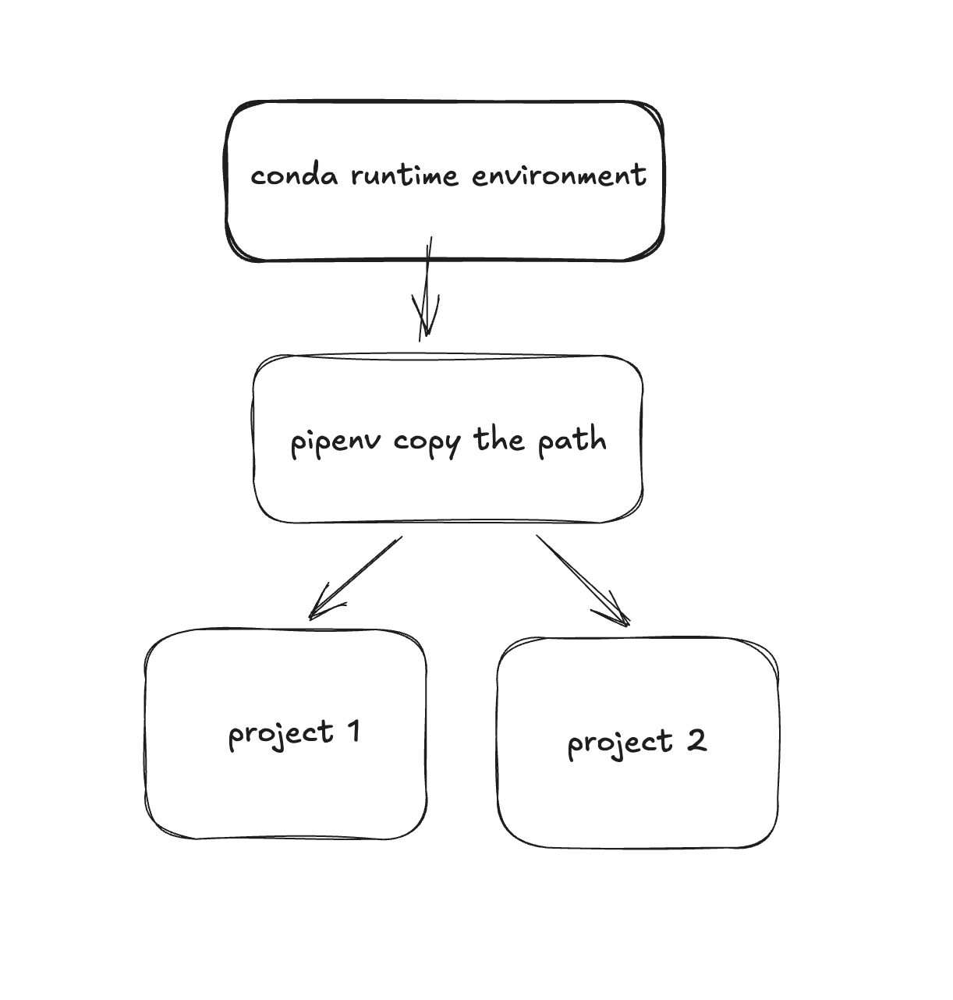

# Python environments

## Using pipenv for environemnt isolation in pyhton development

[Doucmentation is the best!!](https://pipenv.pypa.io/en/latest/)

- collaboration work တွေအတွက်ဆိုရင် pipenv က အသုံးသင့်ဆုံးပဲ ။
- pip+venv ထက်လည်းပိုကောင်းတယ်ပေါ့နော် ။
- lock file ပါတယ်။ Dependency resolution ပိုကောင်းတယ် ။
- Legacy ကဒီလို ဆိုပေမယ့် no longer recommended ပါ။ 
`pip install --user pipenv`

- ဒီထဲက flow ကတော့ python runtime ကို anaconda က ယူပြီး library ကို pipenv ကနေ install မှာပါ။
  
### version စစ်ရန်
`python3 --version` 
`pip3 --version`

### create conda environment, activate it and install python
`conda create --name my_conda_env python=version_needed`
 
`conda activate my_conda_env`
 
`pipenv install --python <python_path_from_conda_env>`

- ပြီးလို့ version check လိုက်ရင် global က python မဟုတ်တော့ဘဲ conda env က python ဖြစ်နေပါပြီ ။

## **ML လုပ်ရင် conda မှာပဲ lib တွေကို env အလိုက် install ထားမှာဆိုတော့ ဒီလို practice ကို used to ဖြစ်သင့်ပါတယ် ။**

| Tool   | Type | Lock File | Speed | Best Use Case | Notes |
|--------|------|-----------|-------|---------------|-------|
| pipenv | All-in-one | Pipfile.lock | Medium | Small–medium projects | Simple but slower; declining popularity |
| poetry | All-in-one | poetry.lock | Medium–Fast | Libraries & apps | Excellent dependency resolution; modern standard |
| uv     | Modern pip replacement | uv.lock | Very Fast | Large projects & CI | Rust-based; extremely fast |
| conda  | Distribution + env | environment.yml | Medium | Data science & ML | Handles binary/CUDA deps very well |

### UV ကတော့ latest and fatest ပဲ

### Docker as python environment
-  If we said docker, what comes to our minds first is **it works on my machine problem**.
-  but what we should more concerned about is **containerization**.
-  If your library need to use Physical layer like GPU, you should thinks container as alternative of env.